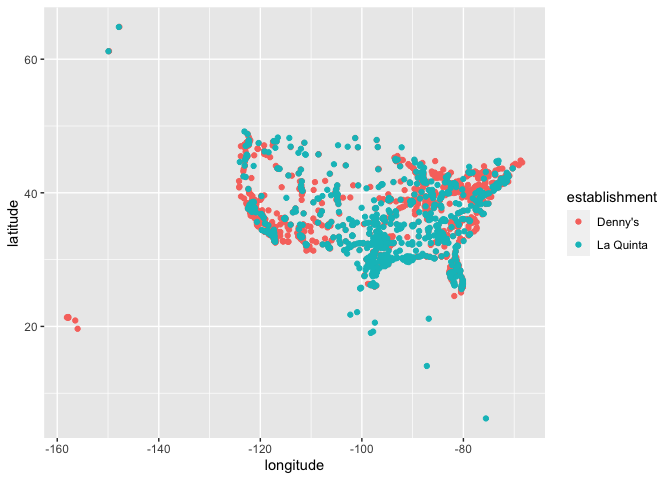
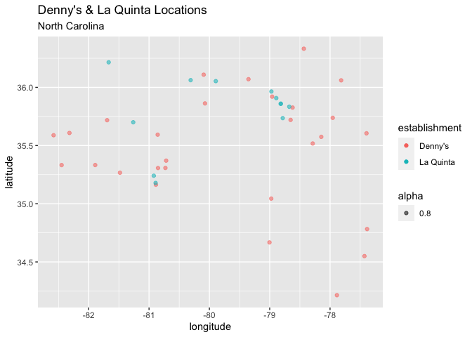
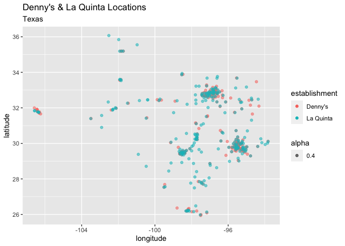

Lab 04 - La Quinta is Spanish for next to Denny’s, Pt. 1
================
Marcus Minko
02-02-2022

### Load packages and data

``` r
library(tidyverse) 
library(dsbox)
```

``` r
states <- read_csv("data/states.csv")
```

### Exercise 1

``` r
nrow(dennys)
```

    ## [1] 1643

``` r
ncol(dennys)
```

    ## [1] 6

``` r
glimpse(dennys)
```

    ## Rows: 1,643
    ## Columns: 6
    ## $ address   <chr> "2900 Denali", "3850 Debarr Road", "1929 Airport Way", "230 …
    ## $ city      <chr> "Anchorage", "Anchorage", "Fairbanks", "Auburn", "Birmingham…
    ## $ state     <chr> "AK", "AK", "AK", "AL", "AL", "AL", "AL", "AL", "AL", "AL", …
    ## $ zip       <chr> "99503", "99508", "99701", "36849", "35207", "35294", "35056…
    ## $ longitude <dbl> -149.8767, -149.8090, -147.7600, -85.4681, -86.8317, -86.803…
    ## $ latitude  <dbl> 61.1953, 61.2097, 64.8366, 32.6033, 33.5615, 33.5007, 34.206…

each row is a particular Denny’s location, and the variables are
address, city, state, zipcode, longitude, and latitude for each
restaurant.

### Exercise 2

``` r
nrow(dennys)
```

    ## [1] 1643

``` r
ncol(dennys)
```

    ## [1] 6

``` r
glimpse(dennys)
```

    ## Rows: 1,643
    ## Columns: 6
    ## $ address   <chr> "2900 Denali", "3850 Debarr Road", "1929 Airport Way", "230 …
    ## $ city      <chr> "Anchorage", "Anchorage", "Fairbanks", "Auburn", "Birmingham…
    ## $ state     <chr> "AK", "AK", "AK", "AL", "AL", "AL", "AL", "AL", "AL", "AL", …
    ## $ zip       <chr> "99503", "99508", "99701", "36849", "35207", "35294", "35056…
    ## $ longitude <dbl> -149.8767, -149.8090, -147.7600, -85.4681, -86.8317, -86.803…
    ## $ latitude  <dbl> 61.1953, 61.2097, 64.8366, 32.6033, 33.5615, 33.5007, 34.206…

same dataset except for laquinta locations

there are 17 non-US locations

you could figure out which locations were not in the us by the state
variable, perhaps. Or maybe with the GPS coordinates.

### Exercise 3

``` r
dennys %>% 
     filter(!(state %in% states$abbreviation))
```

    ## # A tibble: 0 × 6
    ## # … with 6 variables: address <chr>, city <chr>, state <chr>, zip <chr>,
    ## #   longitude <dbl>, latitude <dbl>

``` r
dn <- dennys %>% 
     mutate(country = "United States")  

glimpse(dn)
```

    ## Rows: 1,643
    ## Columns: 7
    ## $ address   <chr> "2900 Denali", "3850 Debarr Road", "1929 Airport Way", "230 …
    ## $ city      <chr> "Anchorage", "Anchorage", "Fairbanks", "Auburn", "Birmingham…
    ## $ state     <chr> "AK", "AK", "AK", "AL", "AL", "AL", "AL", "AL", "AL", "AL", …
    ## $ zip       <chr> "99503", "99508", "99701", "36849", "35207", "35294", "35056…
    ## $ longitude <dbl> -149.8767, -149.8090, -147.7600, -85.4681, -86.8317, -86.803…
    ## $ latitude  <dbl> 61.1953, 61.2097, 64.8366, 32.6033, 33.5615, 33.5007, 34.206…
    ## $ country   <chr> "United States", "United States", "United States", "United S…

…

### Exercise 4

``` r
lq <- laquinta %>%
               mutate(country = case_when(
                   state %in% state.abb     ~ "United States",
                   state %in% c("ON", "BC") ~ "Canada",
                   state == "ANT"           ~ "Colombia", 
                   state == "FM" ~ "Honduras", 
                   state %in% c("AG", "CH", "QR", "PU", "SL", "VE") ~ "Mexico"
               ))
glimpse(lq)
```

    ## Rows: 909
    ## Columns: 7
    ## $ address   <chr> "793 W. Bel Air Avenue", "3018 CatClaw Dr", "3501 West Lake …
    ## $ city      <chr> "\nAberdeen", "\nAbilene", "\nAbilene", "\nAcworth", "\nAda"…
    ## $ state     <chr> "MD", "TX", "TX", "GA", "OK", "TX", "AG", "TX", "NM", "NM", …
    ## $ zip       <chr> "21001", "79606", "79601", "30102", "74820", "75254", "20345…
    ## $ longitude <dbl> -76.18846, -99.77877, -99.72269, -84.65609, -96.63652, -96.8…
    ## $ latitude  <dbl> 39.52322, 32.41349, 32.49136, 34.08204, 34.78180, 32.95164, …
    ## $ country   <chr> "United States", "United States", "United States", "United S…

…

### Exercise 5

``` r
dn %>% 
  count(state) %>%   
    arrange(desc(n))
```

    ## # A tibble: 51 × 2
    ##    state     n
    ##    <chr> <int>
    ##  1 CA      403
    ##  2 TX      200
    ##  3 FL      140
    ##  4 AZ       83
    ##  5 IL       56
    ##  6 NY       56
    ##  7 WA       49
    ##  8 OH       44
    ##  9 MO       42
    ## 10 PA       40
    ## # … with 41 more rows

``` r
dn %>% 
  count(state) %>% 
    arrange(n)
```

    ## # A tibble: 51 × 2
    ##    state     n
    ##    <chr> <int>
    ##  1 DE        1
    ##  2 DC        2
    ##  3 VT        2
    ##  4 AK        3
    ##  5 IA        3
    ##  6 NH        3
    ##  7 SD        3
    ##  8 WV        3
    ##  9 LA        4
    ## 10 MT        4
    ## # … with 41 more rows

Most - CA, Least- DE Not surprising given the respective sizes and
population densities of these states

``` r
lq %>% 
     count(state) %>%   
     arrange(desc(n))
```

    ## # A tibble: 59 × 2
    ##    state     n
    ##    <chr> <int>
    ##  1 TX      237
    ##  2 FL       74
    ##  3 CA       56
    ##  4 GA       41
    ##  5 TN       30
    ##  6 OK       29
    ##  7 LA       28
    ##  8 CO       27
    ##  9 NM       19
    ## 10 NY       19
    ## # … with 49 more rows

``` r
lq %>% 
    filter(country == "United States") %>% 
    count(state) %>%   
     arrange(n)
```

    ## # A tibble: 48 × 2
    ##    state     n
    ##    <chr> <int>
    ##  1 ME        1
    ##  2 AK        2
    ##  3 NH        2
    ##  4 RI        2
    ##  5 SD        2
    ##  6 VT        2
    ##  7 WV        3
    ##  8 WY        3
    ##  9 IA        4
    ## 10 MI        4
    ## # … with 38 more rows

Most- TX, Least - ME Again, Not surprising given the respective sizes
and population densities of these states

…

### Exercise 6

``` r
dn %>%
          count(state) %>%
          inner_join(states, by = c("state" = "abbreviation")) %>% 
          mutate(location_density = area/n) %>% 
          arrange(location_density)
```

    ## # A tibble: 51 × 5
    ##    state     n name                     area location_density
    ##    <chr> <int> <chr>                   <dbl>            <dbl>
    ##  1 DC        2 District of Columbia     68.3             34.2
    ##  2 RI        5 Rhode Island           1545.             309. 
    ##  3 CA      403 California           163695.             406. 
    ##  4 CT       12 Connecticut            5543.             462. 
    ##  5 FL      140 Florida               65758.             470. 
    ##  6 MD       26 Maryland              12406.             477. 
    ##  7 NJ       10 New Jersey             8723.             872. 
    ##  8 NY       56 New York              54555.             974. 
    ##  9 IN       37 Indiana               36420.             984. 
    ## 10 OH       44 Ohio                  44826.            1019. 
    ## # … with 41 more rows

``` r
lq %>%
          count(state) %>%
          inner_join(states, by = c("state" = "abbreviation")) %>% 
          mutate(location_density = area/n) %>% 
          arrange(location_density)
```

    ## # A tibble: 48 × 5
    ##    state     n name             area location_density
    ##    <chr> <int> <chr>           <dbl>            <dbl>
    ##  1 RI        2 Rhode Island    1545.             772.
    ##  2 FL       74 Florida        65758.             889.
    ##  3 CT        6 Connecticut     5543.             924.
    ##  4 MD       13 Maryland       12406.             954.
    ##  5 TX      237 Texas         268596.            1133.
    ##  6 TN       30 Tennessee      42144.            1405.
    ##  7 GA       41 Georgia        59425.            1449.
    ##  8 NJ        5 New Jersey      8723.            1745.
    ##  9 MA        6 Massachusetts  10554.            1759.
    ## 10 LA       28 Louisiana      52378.            1871.
    ## # … with 38 more rows

Denny’s- DC has the greatest density per square mile

La Quinta- RI has greatest density per square mile

### Exercise 7

``` r
dn <- dn %>%
  mutate(establishment = "Denny's")
lq <- lq %>%
  mutate(establishment = "La Quinta")

dn_lq <- bind_rows(dn, lq)

ggplot(dn_lq, mapping = aes(x = longitude, y = latitude, color = establishment)) +
  geom_point()
```

<!-- -->

``` r
dn_lq %>% 
  filter(state == "NC") %>% 
ggplot(dn_lq, mapping = aes(x = longitude, y = latitude, color = establishment, alpha = .8)) + labs(title = "Denny's & La Quinta Locations", subtitle = "North Carolina") +
  geom_point() 
```

<!-- -->

``` r
# It does appear to be true that most La Quinta locations are close to Denny's locations in North Carolina.

dn_lq %>% 
  filter(state == "TX") %>% 
ggplot(dn_lq, mapping = aes(x = longitude, y = latitude, color = establishment, alpha = .4)) + labs(title = "Denny's & La Quinta Locations", subtitle = "Texas") +
  geom_point()
```

<!-- -->

``` r
# It also appears to be true that most La Quinta locations are close to Denny's locations in Texas.
```

…

Add exercise headings as needed.
